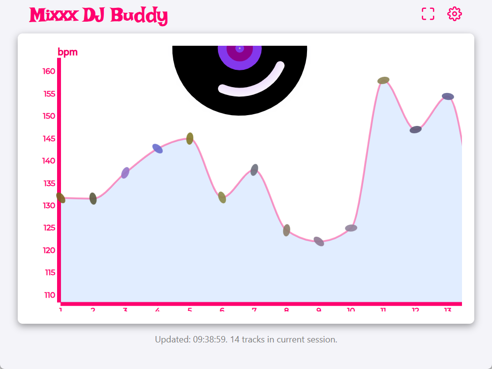
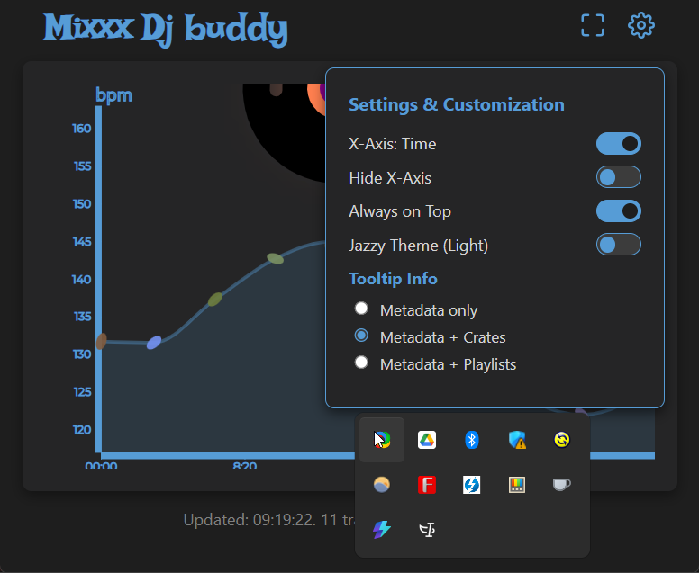

# Mixxx DJ Buddy

Mixxx DJ Buddy is a live analysis companion application for [Mixxx](https://mixxx.org/), designed to help DJs keep track of their performance, analyze the history of tracks played, and provide valuable visual references during sets.

## Features

- **Live DJ Sets Analysis:** Automatically monitors the tracks you play by reading directly from your Mixxx database.
- **Always on Top:** Can be pinned on top of your mixing software so you never lose the visual reference.
- **Customizable UI & Themes:** Supports themes (like Jazzy Light) and toggleable UI features directly from the settings menu.
- **Dynamic Chart Generation:** Visualizes BPM trends and track metadata across your DJ set as you play.
- **Interactive Tooltips:** Hover over or click data points to see which songs were played. The tooltips show which **crates** and **playlists** each song belongs to, and dynamically highlight any crates the song shares with the previously played track to help you understand your mixing flow.

## Screenshots

### Main Interface



### Settings Menu



## Demo

Watch a short screen recording demonstrating the app in action:

<video width="800" controls>
  <source src="./screenshots/screen_recording_compressed.mp4" type="video/mp4">
  <a href="./screenshots/screen_recording_compressed.mp4">Download the screen recording</a>
</video>

## Getting Started

### Prerequisites

- Go 1.25.3 or later
- [Mixxx](https://mixxx.org/) installed and running on your system (the app automatically locates the default `mixxxdb.sqlite` location based on your OS)

### Installation & Build

Clone the repository and build the executable:

```bash
git clone <repository_url>
cd mixxx-dj-buddy
go mod tidy
go build -ldflags="-H windowsgui" -o mixxx-dj-buddy.exe
```

### Usage

Run the built executable:

```bash
./mixxx-dj-buddy.exe
```

A window will pop up showing the Live Analysis. The app connects to the `mixxxdb.sqlite` to read the ongoing playlist history, automatically updating the chart when you change or play new tracks.

Click on the settings icon on the top right to customize your experience, pin the window, or change the visual theme.

## Future Plans

- **Advanced Audio Features**: Moving away from using BPM as the primary metric, future versions will incorporate metrics that serve as better proxies for the perceived energy and musical qualities of the tracks. This will provide a more detailed and accurate visualization of the set's flow and dynamic range.
